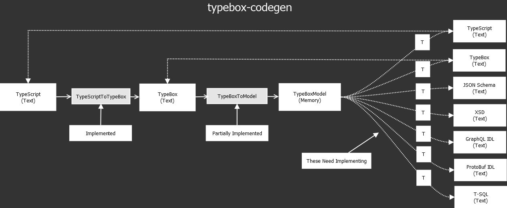

# typebox-codegen

## Overview

This package provides code generation for TypeBox types

## Architecture

The following is the initial architecture for code transformations to be provided by this package



## Running Local

Clone the project and run the following commands.

```bash
$ npm install      # install dependencies

$ npm format       # prettier pass for `src` and `example`

$ npm clean        # remove the `target` directory.

$ npm start        # run the `example` script in node

$ npm serve        # run the `example` script in browser
```