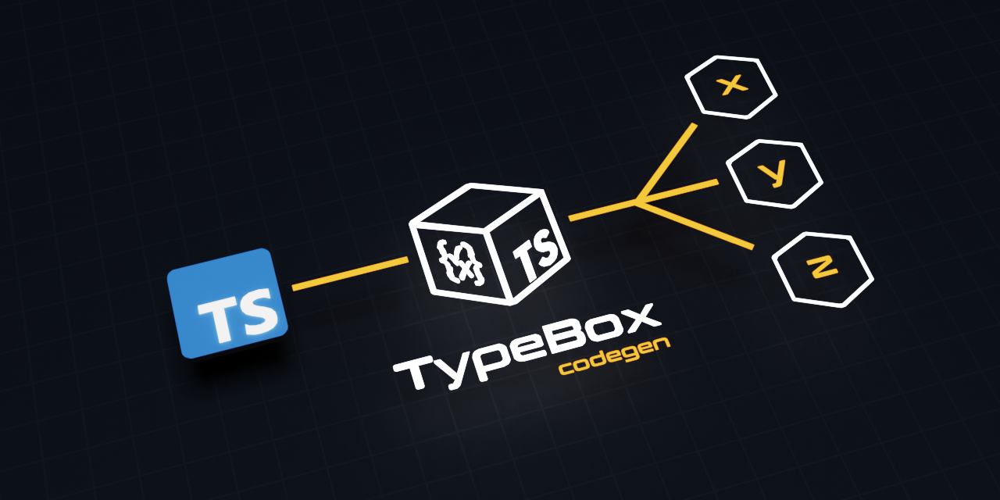

<div align='center'>

<h1>TypeBox Codegen</h1>

<p>Code Generation Tools for TypeBox</p>



<br />

</div>

## Overview

TypeBox-Codegen is a code generation tool that converts TypeScript types into TypeBox types as well as several other schema and library representations. It works by extracting structural type information from the TypeScript compiler and maps into a TypeBox specific model. This model can then be passed on to various code generators to generate a multitude of various type representations by introspecting TypeBox's schematics.

The library contains various code transformations for libraries such as Zod, Io-Ts, ArkType and Valibot, function generators for JavaScript and TypeScript (derived from the TypeCompiler) as well as JSON Schema generation derived from TypeBox's raw schematics. This project is written as a backend for command line tooling, website integration and as a tool to assert TypeBox alignment with the TypeScript type system.

License MIT

## Usage

```typescript
import * as Codegen from '@sinclair/typebox-codegen'

const Code = `
export type T = {
  x: number,
  y: number,
  z: number
}
`
// ----------------------------------------------------------------------------
//
// TypeScriptToTypeBox
//
// Generates an immediate TypeScript to TypeBox type code transformation
//
// ----------------------------------------------------------------------------

console.log('TypeScript To TypeBox', Codegen.TypeScriptToTypeBox.Generate(Code))

// ----------------------------------------------------------------------------
//
// TypeScriptToModel
//
// Generates an in-memory TypeBox Type Model
//
// ----------------------------------------------------------------------------

const model = Codegen.TypeScriptToModel.Generate(Code)

// ----------------------------------------------------------------------------
//
// ModelToX
//
// The TypeBox Type Model can be passed to several generators which map the
// Model into varying type representations.
//
// ----------------------------------------------------------------------------

console.log('TypeBoxModel', model)
console.log('Model To JsonSchema', Codegen.ModelToJsonSchema.Generate(model))
console.log('Model To JavaScript', Codegen.ModelToJavaScript.Generate(model))
console.log('Model To TypeScript', Codegen.ModelToTypeScript.Generate(model))
console.log('Model To Valibot', Codegen.ModelToValibot.Generate(model))
console.log('Model To Value', Codegen.ModelToValue.Generate(model))
console.log('Model To Yup', Codegen.ModelToYup.Generate(model))
console.log('Model To Zod', Codegen.ModelToZod.Generate(model))
console.log('Model To ArkType', Codegen.ModelToArkType.Generate(model))
```

## Running Local

Clone the project and run the following commands.

```bash
$ npm install      # install dependencies

$ npm format       # prettier pass for `src` and `example`

$ npm clean        # remove the `target` directory.

$ npm start        # run the `example` script in node
```

## Formatting hook

Set up pre-commit formatting hook by running `cp ./.git-hooks/pre-commit ./.git/hooks/`
